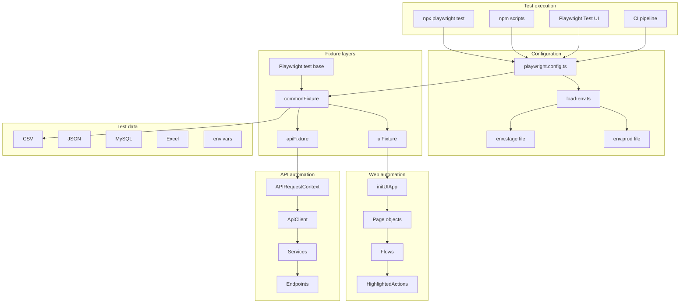
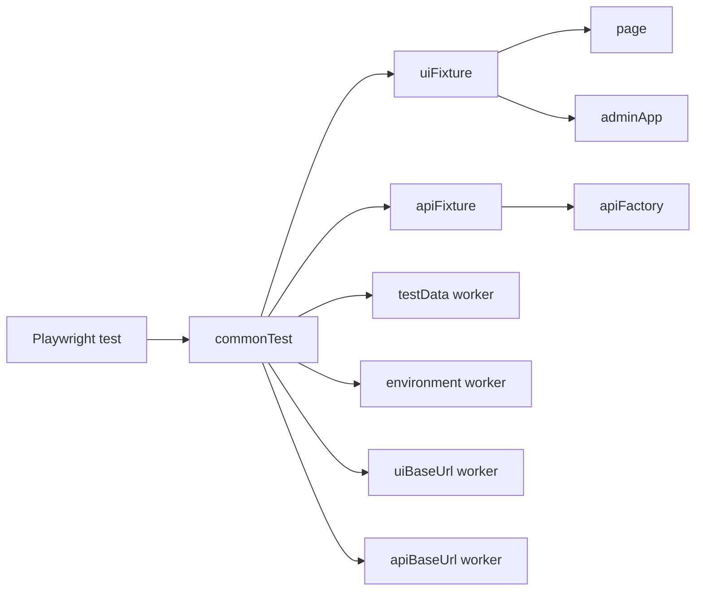
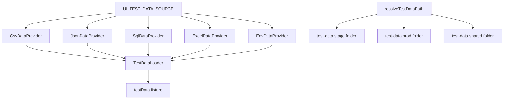

# Playwright Automation Framework — Design Document

**Project:** `playwright-automation`  
**Stack:** Playwright Test, TypeScript, dotenv  
**Scope:** Web (UI) and API test automation with shared fixtures, environment control, and pluggable test data.

---

## 1. Purpose

This framework provides a single repository to:

- Run **web (E2E) tests** against a configurable UI base URL (browser + page objects + flows).
- Run **API tests** against a configurable API base URL (HTTP client + endpoints + services).
- Switch **stage vs production** without code changes.
- Load test data from **CSV, JSON, Excel, SQL, or environment variables**.
- Support **highlighted UI actions** for demos and debugging.

Both test types can be triggered independently or together via Playwright projects, npm scripts, CLI flags, and the Playwright UI.

---

## 2. High-Level Architecture



---

## 3. Repository Structure

```
playwright-automation/
├── docs/
│   └── FRAMEWORK_DESIGN.md          # This document
├── playwright.config.ts           # Projects, reporters, env bootstrap
├── .env.stage                       # Stage / UAT variables
├── .env.prod                        # Production variables
├── .env.example                     # Template (no secrets)
├── package.json                     # npm scripts for UI / API / env
├── test-data/
│   ├── stage/ui/login.csv           # Stage UI credentials
│   ├── prod/ui/login.csv            # Prod UI credentials
│   └── sql/login-credentials.sql    # SQL-backed data (optional)
├── tests/
│   ├── ui/                          # Web specs → uiFixture
│   │   └── login.spec.ts
│   └── api/                         # API specs → apiFixture
│       └── pet.spec.ts
└── src/
    ├── config/
    │   ├── load-env.ts              # PROD=1 → .env.prod else .env.stage
    │   └── env.ts                   # Typed env object (single source)
    ├── commons/
    │   ├── env/EnvUtils.ts          # stage | prod helpers
    │   ├── data/                    # Test data providers + loader
    │   └── playwright/              # Highlight, wait, screenshot helpers
    ├── fixtures/
    │   ├── commonFixture.ts         # Shared worker fixtures
    │   ├── uiFixture.ts             # adminApp
    │   └── apiFixture.ts            # apiFactory
    ├── ui/
    │   ├── pages/                   # Page objects (BasePage)
    │   ├── flows/                   # Multi-step workflows
    │   ├── factory/                 # initUIApp, initPages
    │   └── interfaces/              # UIApp contract
    └── api/
        ├── config/api-paths.ts      # Relative API paths
        ├── client/                  # ApiClient, ApiFactory
        ├── endpoints/               # IHttpRequest implementations
        ├── services/                # Domain services (e.g. PetService)
        ├── builders/                # Test entity builders
        └── models/                  # DTOs / interfaces
```

---

## 4. Playwright Projects (How Web & API Are Triggered)

Playwright **projects** control which specs run and with which defaults.

| Project    | `testMatch`        | Browser / `baseURL`                         | Use case                          |
|-----------|--------------------|---------------------------------------------|-----------------------------------|
| `chromium`| `tests/**`         | Desktop Chrome + `UI_BASE_URL`              | Default; Playwright UI, full suite |
| `ui`      | `tests/ui/**`      | Desktop Chrome + `UI_BASE_URL`              | Web tests only                    |
| `api`     | `tests/api/**`     | Desktop Chrome (no UI `baseURL` on `page`)  | API tests only                    |

**Important:** API tests do not use `page.goto`. They use a dedicated `APIRequestContext` created in `apiFixture` with `API_BASE_URL` as `baseURL`. UI tests use Playwright `page` with `UI_BASE_URL` from the project config.

### 4.1 Execution matrix

| Goal              | Command |
|-------------------|---------|
| All tests (stage) | `npm test` or `npx playwright test` |
| Web only          | `npm run test:ui` |
| API only          | `npm run test:api` |
| Stage (explicit)  | `npm run test:stage` |
| Production        | `npm run test:prod` |
| Single UI file    | `npx playwright test tests/ui/login.spec.ts --project=ui` |
| Single API file   | `npx playwright test tests/api/pet.spec.ts --project=api` |
| Playwright UI     | `npx playwright test --ui` (select project: `chromium`, `ui`, or `api`) |
| Headed UI demo    | `HIGHLIGHT_ACTIONS=true npx playwright test tests/ui --project=ui --headed` |

### 4.2 CI recommendation

```yaml
# Example Jenkins / GitHub Actions pattern
- name: UI tests (stage)
  run: npm run test:ui:stage
  env:
    CI: '1'

- name: API tests (stage)
  run: npm run test:api
  env:
    CI: '1'

- name: Prod smoke (scheduled)
  run: npm run test:prod -- --project=ui
  env:
    CI: '1'
    PROD: '1'
```

Run UI and API in **parallel jobs** for faster feedback. Use `CI=1` for headless mode and retries (see `playwright.config.ts`).

---

## 5. Environment Management (Stage / Prod)

Modeled after enterprise patterns (e.g. Allen web automation): one flag selects the env file.

| `PROD` value | File loaded   | `env.name` |
|--------------|---------------|------------|
| not set / `0`| `.env.stage`  | `stage`    |
| `1`          | `.env.prod`   | `prod`     |

**Bootstrap order:**

1. `playwright.config.ts` calls `loadEnv()`.
2. `src/config/env.ts` calls `loadEnv()` again (idempotent) when imported by tests/framework code.
3. `env` object exposes `uiBaseUrl`, `apiBaseUrl`, `highlightActions`, etc.

**Required variables:**

| Variable            | Used by        | Description                    |
|---------------------|----------------|--------------------------------|
| `UI_BASE_URL`       | UI projects    | Admin / app under test         |
| `API_BASE_URL`      | API fixture    | REST API root (trailing `/` OK)|
| `UI_TEST_DATA_SOURCE` | TestDataLoader | `csv` \| `json` \| `sql` \| `excel` \| `env` |
| `HIGHLIGHT_ACTIONS` | UI actions     | `true` = flash before click/fill |
| `ADMIN_*`           | Login data     | Fallback when using `env` source |

**Prod-only specs:** Name files `*.prod.spec.ts`. They are **ignored on stage** via `testIgnore` in config.

---

## 6. Fixture Design



### 6.1 Common fixtures (worker scope)

| Fixture       | Type        | Description                                      |
|---------------|-------------|--------------------------------------------------|
| `environment` | `stage` \| `prod` | Active environment name                    |
| `uiBaseUrl`   | `string`    | From `env.uiBaseUrl`                             |
| `apiBaseUrl`  | `string`    | From `env.apiBaseUrl`                            |
| `testData`    | `UITestData`| Login scenarios from configured data source      |

### 6.2 UI fixture (test scope)

| Fixture    | Type     | Description                                      |
|------------|----------|--------------------------------------------------|
| `page`     | `Page`   | Playwright browser page                            |
| `adminApp` | `UIApp`  | `{ pages, login }` from `initUIApp(page)`         |

**Spec import:**

```typescript
import { test, expect } from '../../src/fixtures/uiFixture';
```

### 6.3 API fixture (test scope)

| Fixture      | Type         | Description                                |
|--------------|--------------|--------------------------------------------|
| `apiFactory` | `ApiFactory` | Services wired to isolated request context |

**Spec import:**

```typescript
import { test, expect } from '../../src/fixtures/apiFixture';
```

Each test gets a fresh `APIRequestContext` disposed after the test.

---

## 7. Web Automation Layer

### 7.1 Patterns

| Pattern        | Implementation                          | Role                                      |
|----------------|-----------------------------------------|-------------------------------------------|
| Page Object    | `LoginPage extends BasePage`            | Locators + page-level actions             |
| Flow           | `LoginFlow`                             | Multi-step business sequence              |
| App factory    | `initUIApp(page)`                       | Registry of pages + flows (Allen: initWebPOMs) |
| Highlighted actions | `HighlightedActions` in `BasePage` | Optional visual flash before interactions |

### 7.2 UI test flow (example)

```
login.spec.ts
  → uiFixture (adminApp, testData, page)
    → LoginFlow.loginAs(user, pass)
      → LoginPage.loginAs
        → actions.fill / actions.click (with optional highlight)
          → page navigates to admin dashboard
            → expect(page).toHaveURL(...)
```

### 7.3 Adding a new UI feature

1. Create `src/ui/pages/MyPage.ts` extending `BasePage`.
2. Register in `src/ui/factory/init-pages.ts`.
3. Add flow in `src/ui/flows/` if multi-page logic is needed.
4. Wire in `src/ui/factory/init-ui-app.ts` and `src/ui/interfaces/UIApp.ts`.
5. Add `tests/ui/my-feature.spec.ts` using `uiFixture`.
6. Add rows to `test-data/stage/ui/...` and `test-data/prod/ui/...`.

---

## 8. API Automation Layer

### 8.1 Request pipeline

```
pet.spec.ts
  → apiFactory.petService.addPet(pet)
    → PetService
      → ApiClient.processRequest(AddPetEndpoint)
        → APIRequestContext.post('pet', ...)   // relative to API_BASE_URL
          → ApiResponse<Pet>
```

### 8.2 Layer responsibilities

| Layer      | Responsibility                                      |
|------------|-----------------------------------------------------|
| Endpoint   | HTTP method, path (`api-paths.ts`), headers, body   |
| Service    | Domain operation (e.g. `addPet`)                    |
| ApiClient  | Execute request, parse JSON, error on non-JSON    |
| ApiFactory | Group services for fixture injection              |
| Builder    | Generate test payloads (e.g. `PetBuilder`)        |

### 8.3 Adding a new API test

1. Add path constant in `src/api/config/api-paths.ts`.
2. Create endpoint class implementing `IHttpRequest`.
3. Add method on service + register on `ApiFactory` if new domain.
4. Create `tests/api/my-api.spec.ts` using `apiFixture`.

---

## 9. Test Data Management



**Resolution rule:** Prefer `test-data/{stage|prod}/<path>`, else `test-data/<path>`.

**UI login CSV columns:** `scenario`, `username`, `password`, `expectedUrlPattern`

---

## 10. Cross-Cutting Concerns

| Concern      | Implementation                                      |
|--------------|-----------------------------------------------------|
| Logging      | Playwright HTML reporter; optional trace on retry     |
| Screenshots  | `only-on-failure` (config); `captureFullPage` helper  |
| Retries      | 2 on CI, 0 locally                                  |
| Parallelism  | `fullyParallel: true`                               |
| Secrets      | `.env.stage` / `.env.prod` (do not commit passwords)|
| Allure       | Dependency present; wire reporter when needed       |

---

## 11. Dependencies

| Package            | Purpose                          |
|--------------------|----------------------------------|
| `@playwright/test` | Runner, browser, API request     |
| `dotenv`           | Env file loading                 |
| `@faker-js/faker`  | Dynamic API test data (v9, CJS)  |
| `mysql2`           | SQL test data provider           |
| `xlsx`             | Excel test data provider         |
| `cross-env`        | `PROD=1` on Windows scripts      |
| `zod`              | Reserved for schema validation   |
| `allure-playwright`| Optional reporting               |

---

## 12. Design Decisions

| Decision | Rationale |
|----------|-----------|
| Separate `ui` and `api` projects | Run web/API independently in CI; faster API feedback |
| Keep `chromium` project for all tests | Playwright UI defaults to `chromium` project name |
| `commonFixture` base layer | Shared `testData` and URLs (Allen-style common fixtures) |
| Relative API paths + request `baseURL` | Avoid hard-coded full URLs in endpoints |
| `initUIApp` vs class factory | Avoid ESM/CJS constructor issues; matches Allen `initWebPOMs` |
| Env-specific test-data folders | Stage/prod credentials isolation |
| `HIGHLIGHT_ACTIONS` toggle | Fast CI, visible local demos |

---

## 13. Future Enhancements (Out of Scope Today)

- Global setup / teardown (secrets manager, DB pool like Allen `load-test-data.ts`)
- YAML-driven API tests (Allen `yaml-test-runner`)
- Allure reporter in `playwright.config.ts`
- Zod validation on CSV/JSON rows
- Dedicated `api` project without browser launch (Playwright still spins worker; acceptable)
- Tag-based execution (`@smoke`, `@regression`)

---

## 14. Quick Reference Card

```
# Environment
PROD=1                    → production config
UI_TEST_DATA_SOURCE=csv   → data provider

# Trigger web
npm run test:ui
npx playwright test tests/ui --project=ui

# Trigger API
npm run test:api
npx playwright test tests/api --project=api

# Trigger both (stage)
npm test

# Debug UI with highlights
HIGHLIGHT_ACTIONS=true npx playwright test tests/ui --headed --project=ui
```

---

**Document version:** 1.1  
**Last aligned with codebase:** March 2026  
**Note:** Mermaid diagrams use GitHub-safe node IDs (no `@`, `/`, or duplicate IDs).
