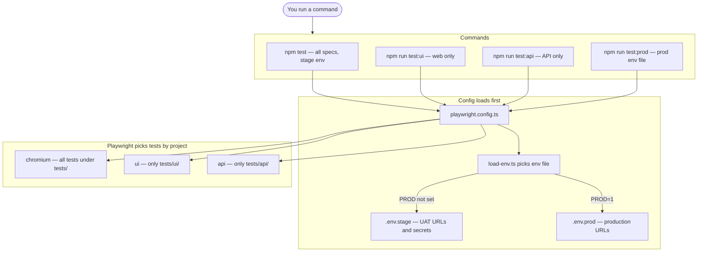
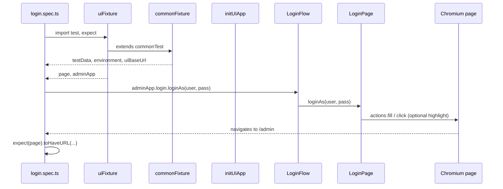
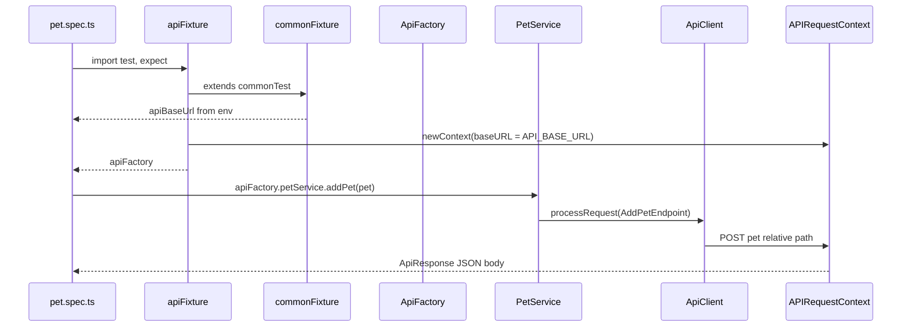
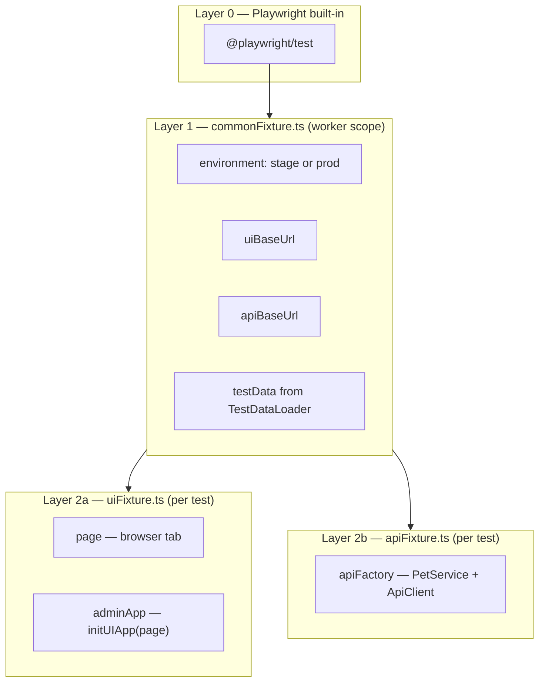
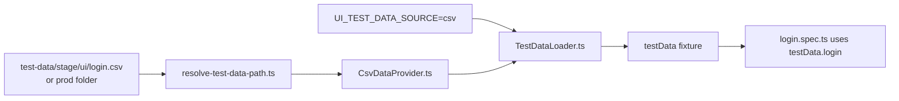

# Playwright Automation Framework — Design Document

**Project:** `playwright-automation`  
**Stack:** Playwright Test, TypeScript, dotenv  
**Scope:** Web (UI) and API tests in one repo, with stage/prod config and CSV-based login data (default).

---

## 1. Purpose

| Capability | How |
|------------|-----|
| Run **web tests** | Browser + `tests/ui/*.spec.ts` + `uiFixture` |
| Run **API tests** | HTTP client + `tests/api/*.spec.ts` + `apiFixture` |
| **Stage vs prod** | `PROD=1` loads `.env.prod`, else `.env.stage` |
| **Test data** | Default: `test-data/stage/ui/login.csv` or `test-data/prod/ui/login.csv` |
| **Demo-friendly UI** | Optional red/yellow flash before clicks (`HIGHLIGHT_ACTIONS`) |

---

## 2. How to run tests (execution flow)

This diagram answers: *“What do I run, and what gets loaded?”*



| Project | Runs | Browser `baseURL` |
|---------|------|-------------------|
| `chromium` | `tests/ui/**` + `tests/api/**` | `UI_BASE_URL` (for web) |
| `ui` | `tests/ui/**` only | `UI_BASE_URL` |
| `api` | `tests/api/**` only | API uses `API_BASE_URL` in fixture, not page |

---

## 3. What happens inside a test (runtime flow)

### 3.1 Web test (example: `tests/ui/login.spec.ts`)



### 3.2 API test (example: `tests/api/pet.spec.ts`)



---

## 4. Fixture chain (shared → UI or API)



| Spec type | Import from | Extra fixtures |
|-----------|-------------|----------------|
| Web | `src/fixtures/uiFixture.ts` | `page`, `adminApp` |
| API | `src/fixtures/apiFixture.ts` | `apiFactory` |
| Both | (via above) | `testData`, `environment`, `uiBaseUrl`, `apiBaseUrl` |

---

## 5. Test data flow (default: CSV)

Used today by `tests/ui/login.spec.ts` when `UI_TEST_DATA_SOURCE=csv` (default in `.env.stage`).



**CSV columns:** `scenario`, `username`, `password`, `expectedUrlPattern`

**Other sources (code exists, not used by current specs):** set `UI_TEST_DATA_SOURCE` to `json`, `sql`, `excel`, or `env` — see `TestDataLoader.ts` and providers under `src/commons/data/providers/`.

---

## 6. Repository structure (files in use)

Only paths that exist and participate in the current test runs:

```
playwright-automation/
├── docs/FRAMEWORK_DESIGN.md
├── playwright.config.ts
├── package.json
├── tsconfig.json
├── .env.stage                # local stage (gitignored)
├── .env.prod                 # local prod (gitignored)
├── test-data/
│   ├── stage/ui/login.csv    # used by UI login test (stage)
│   ├── prod/ui/login.csv     # used by UI login test (prod)
│   └── sql/login-credentials.sql  # only if UI_TEST_DATA_SOURCE=sql
├── tests/
│   ├── ui/login.spec.ts      # web — uiFixture
│   └── api/pet.spec.ts       # API — apiFixture
└── src/
    ├── config/
    │   ├── load-env.ts
    │   └── env.ts
    ├── commons/
    │   ├── env/EnvUtils.ts
    │   ├── data/
    │   │   ├── TestDataLoader.ts
    │   │   ├── resolve-test-data-path.ts
    │   │   ├── DataSourceType.ts
    │   │   ├── contracts/IDataProvider.ts
    │   │   └── providers/
    │   │       ├── CsvDataProvider.ts      # default
    │   │       ├── EnvDataProvider.ts      # fallback
    │   │       ├── JsonDataProvider.ts     # optional via env
    │   │       ├── ExcelDataProvider.ts    # optional via env
    │   │       └── SqlDataProvider.ts      # optional via env
    │   └── playwright/
    │       ├── highlight.ts
    │       ├── HighlightedActions.ts       # used by BasePage
    │       ├── wait-helper.ts              # used by BasePage
    │       ├── locator-helper.ts           # exported, not used yet
    │       ├── screenshot-helper.ts        # exported, not used yet
    │       └── date-helper.ts              # exported, not used yet
    ├── data/models/
    │   ├── LoginCredentials.ts
    │   └── UITestData.ts
    ├── fixtures/
    │   ├── commonFixture.ts
    │   ├── uiFixture.ts
    │   └── apiFixture.ts
    ├── ui/
    │   ├── pages/BasePage.ts
    │   ├── pages/LoginPage.ts
    │   ├── flows/LoginFlow.ts
    │   ├── factory/init-pages.ts
    │   ├── factory/init-ui-app.ts
    │   └── interfaces/UIApp.ts
    └── api/
        ├── config/api-paths.ts
        ├── client/ApiClient.ts
        ├── client/ApiFactory.ts
        ├── contracts/IHttpRequest.ts
        ├── contracts/HttpMethod.ts
        ├── endpoints/pet/AddPetEndpoint.ts   # used by PetService
        ├── services/PetService.ts
        ├── builders/PetBuilder.ts
        ├── enums/PetStatus.ts
        ├── models/Pet.ts
        ├── models/Category.ts              # optional on Pet type only
        ├── models/Tag.ts                     # optional on Pet type only
        └── response/
            ├── ApiResponse.ts
            └── BaseResponse.ts
```

### Not in active use (omitted from diagrams above)

| File | Reason |
|------|--------|
| `GetPetByStatusEndpoint.ts` | Defined but not called from `PetService` (scaffold for future GET tests) |
| `commons/playwright/locator-helper.ts` | Re-exported only; no spec/page imports |
| `commons/playwright/screenshot-helper.ts` | Same |
| `commons/playwright/date-helper.ts` | Same |
| `allure-playwright`, `zod` in package.json | Installed; not wired in `playwright.config.ts` |

---

## 7. Environment variables

| Variable | Required | Used by |
|----------|----------|---------|
| `UI_BASE_URL` | Yes | UI projects (`page.goto` base) |
| `API_BASE_URL` | Yes | `apiFixture` request context |
| `UI_TEST_DATA_SOURCE` | No (default `csv`) | `TestDataLoader` |
| `HIGHLIGHT_ACTIONS` | No | `HighlightedActions` |
| `ADMIN_USERNAME`, `ADMIN_PASSWORD`, `ADMIN_EXPECTED_URL` | For `env` data source / fallback | `EnvDataProvider` |
| `PROD` | No | `load-env.ts` → `.env.prod` when `1` |
| `DB_*` | Only if `UI_TEST_DATA_SOURCE=sql` | `SqlDataProvider` |

---

## 8. Commands quick reference

```bash
# Stage — all tests
npm test

# Web only
npm run test:ui

# API only
npm run test:api

# Production env file
npm run test:prod

# Playwright UI mode
npx playwright test --ui

# Single file
npx playwright test tests/api/pet.spec.ts --project=api
npx playwright test tests/ui/login.spec.ts --project=ui
```

---

## 9. Adding new coverage

### Web

1. `src/ui/pages/MyPage.ts` → extend `BasePage`
2. Register in `init-pages.ts` → wire `init-ui-app.ts` + `UIApp.ts`
3. Add `LoginFlow`-style flow if needed
4. `tests/ui/my-feature.spec.ts` → import `uiFixture`
5. Rows in `test-data/stage/ui/` and `test-data/prod/ui/`

### API

1. Path in `api-paths.ts`
2. Endpoint class + method on service + `ApiFactory` if new domain
3. `tests/api/my-api.spec.ts` → import `apiFixture`

---

## 10. CI example

```yaml
- name: UI tests (stage)
  run: npm run test:ui
  env: { CI: "1" }

- name: API tests (stage)
  run: npm run test:api
  env: { CI: "1" }
```

---

## 11. Future enhancements

- Wire `GetPetByStatusEndpoint` into `PetService`
- `*.prod.spec.ts` for prod-only smoke (ignored on stage via `testIgnore`)
- Allure reporter, Zod validation on CSV rows
- YAML API runner, global setup / secrets manager

---

**Document version:** 2.0  
**Aligned with repo:** March 2026 — diagrams list only files used in current `login.spec.ts` and `pet.spec.ts` runs.
